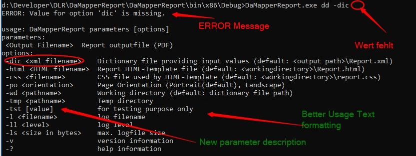

## Command Line Parser

Writing console application can be easier done while using the quazar command line parser class.



### Setup your Command Line

First provide a description about the parameters and options. The usage text shown above will be automatically generate from this information.

```csharp
void SetupParser(CommandLineParser parser)
{
	// setup which options do we have
	parser.AddOption("dic", true, "Dictionary file providing input values (default: <output path>\\Report.xml)", "xml filename");
	parser.AddOption("html", true, "Report HTML-Template file (default: <workingdirectory>\\Report.html)", "HTML filename");
	parser.AddOption("css", true, "CSS file used by HTML-Template (default: <workingdirectory>\\report.css)", "filename");
	parser.AddOption("po", true, "Page Orientation (Portrait(default), Landscape)", "orientation");

	parser.AddOption("wd", true, "Working directory (default: dictionary file path)", "pathname");           
	parser.AddOption("tmp", true, "Temp directory", "pathname");
    // just an alternative interface
    parser.AddOption(new Option { Name = "tst", Description = "for testing purpose only", HasParameter = true, Optional = true });

	parser.AddOption(new Option { Name = "l", Description = "log filename", HasParameter = true, ParameterDescription = "filename" });
	parser.AddOption(new Option { Name = "ll", Description = "log level", HasParameter = true, ParameterDescription = "level" });
	parser.AddOption(new Option { Name = "ls", Description = "max. logfile size", HasParameter = true, ParameterDescription = "size in bytes" });

	// setup which parameter(s) do we have
	parser.AddParameter("Output Filename", "Report outputfile (PDF)", false);

	// add -v, -h, -?
	parser.AddDefaultOptions();  
	parser.AcceptUnmatched = false;  // we do not allow unprocessed arguments
}
```

### Parse it

Let the parser parse your given command line arguments. Than investigate the error conditions. If everything is fine retrieve the information from the parser data tables.

```csharp
static int Main(string[] args)
{
	Log.Setup("qAWellCmd",DbgOutput.Default|DbgOutput.Stdout);
	int rc = 0;

	Parameters Params = ParseCmdLine(args, out rc);
	if(Params==null) { return rc; };

	try { /** ... run your app ... **/ }
	catch(SystemException ex)
	{
		rc = ex.HResult;
		Log.E(QStr.MakeStr(ex));
	}
	return rc;
}
static Parameters ParseCmdLine(string[] args, out int rc)
{
	Parameters parms = new Parameters();                    // initialize your model with App.Config.Defaults in the constructor
	CommandLineParser parser = new CommandLineParser(args); // make a parser instance

	SetupParser(parser); // setup the command line information(s. above)
	parser.Parse();      // parse it
	rc = 0;		     // initialze error code with 'no error(0)'

	// check errors and special options (help and/or version)
	if (parser.IsOptionHelp() || parser.IsOptionVersion())
	{
        // exit here if '-v', '-?' or '-h' was seen
        Console.WriteLine("{0}", parser.IsValid("v") ? parser.AppVersionText : parser.Usage);
		return null; // signal here to quit the process (rc=0)
	}
	else if (!parser.IsValid())
	{
        // exit here if we have invalid arguments
		Console.WriteLine("ERROR: {0}\n", parser.ParseErrorMsg());
		Console.WriteLine("{0}", parser.Usage);
		rc = 1;
		return null; // signal here to quit the process and return an error code (rc=1)
	}

	// get our one and only argument
	parms.Outputfile = parser[0];

    // if the option was found read the parameter (required parameters)
	if (parser.IsValid("html")) parms.HtmlTemplateFile = parser["html"];
	if (parser.IsValid("css")) parms.CssFile = parser["css"];
	if (parser.IsValid("wd")) parms.WorkingDirectory = parser["wd"];
	if (parser.IsValid("dic")) parms.Dictionary = parser["dic"];

    // if the option was found read the parameter (optional parameters)
	parms.Orientation = parser.GetOptionValue("po",Properties.Settings.Default.Orientation);
	parms.TempDir = parser.GetOptionValue("tmp", Path.GetTempPath());

	// Some convenience methods to read log parameters
	Quazar.Diagnostics.Log.FileName = parser.GetLogfile();
	Quazar.Diagnostics.Log.MaxLevel = parser.GetLoglevel();
	if (parser.IsValid("ls")) Log.MaxSize = long.Parse(parser["ls"]);

	return parms; // done
}
```
